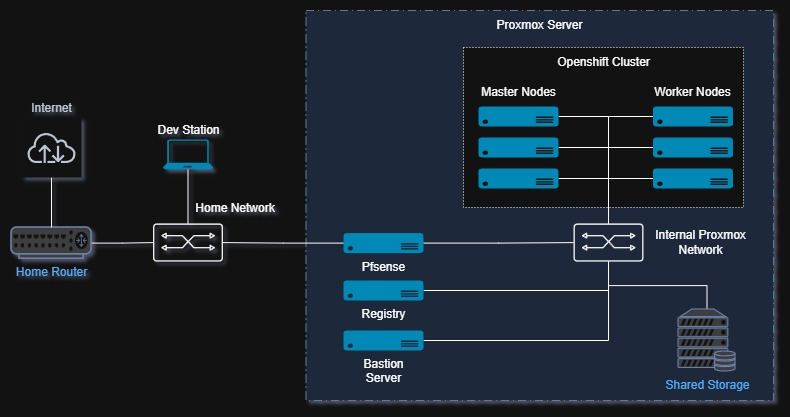

# Openshift cluster 
This document will describe the openshift installation on my lab. This is for leaning purposes and simulates offline environment.

All machines for this cluster are running on my proxmox server. Some could be combined but as for learning I preferred to keep isolated.

## Architecture

### Host Functions

- Pfsense -> internal DNS, DHCP, Load Balance, Firewall, NTP Server.
- Registry Server -> will host internal openshift images for deployment.
- Bastion Server -> openshift commands, http server (ignition)
- Proxmox Server is HP DL380 G9 that will host the VMs.

### Network Plan

| Network | CIDR | Function |
|---------|------|----------|
| Home | 10.0.0.0/24 | Home network |
| OCP Machine | 192.168.100.0/24 | all ocp VMs |
| OCP Pods | 10.128.0.0/14 | Pod to Pod SDN |
| OCP services | 172.30.0.0/16 | Kubernetes service network |

#### IP assignments

| Host | Home Net | OCP Net | Role |
|------|----------|---------|------|
| Home Router | 10.0.0.1 | - | Home Gateway + DNS |
| pfSense VM | 10.0.0.50 | 192.168.100.1 | OCP router/DNS/LB |
| Bastion VM | - | 192.168.100.2 | Jump host / admin |
| Registry VM | - | 192.168.100.3 | Mirror registry |
| Bootstrap | - | 192.168.100.10 | Temp bootstrap |
| master-1 | - | 192.168.100.11 | Control Plane |
| master-2 | - | 192.168.100.12 | Control Plane |
| master-3 | - | 192.168.100.13 | Control Plane |
| worker-1 | - | 192.168.100.21 | Compute |
| worker-2 | - | 192.168.100.122 | Compute |