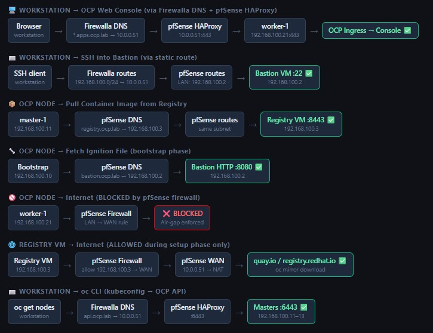

# Openshift cluster 
This document will describe the openshift installation on my lab. This is for learning purposes and simulates an offline environment.

All machines for this cluster are running on my Proxmox server. Some could be combined but for learning purposes I preferred to keep them isolated.

## Architecture


### Host Functions

- **pfSense** → Internal DNS, DHCP, Load Balancer, Firewall, NTP Server
- **Registry Server** → Hosts internal OpenShift images for deployment (Quay mirror registry)
- **Bastion Server** → OpenShift CLI tools, HTTP server (ignition files + RHCOS images), TFTP server (PXE boot)
- **Proxmox Server** → HP DL380 G9 that hosts all VMs

### Network Plan

Domain: `ocp.lab`

| Network | CIDR | Function |
|---------|------|----------|
| Home | 10.0.0.0/24 | Home network |
| OCP Machine | 192.168.100.0/24 | All OCP VMs |
| OCP Pods | 10.128.0.0/14 | Pod to Pod SDN |
| OCP Services | 172.30.0.0/16 | Kubernetes service network |

#### IP Assignments
| Host | Home Net | OCP Net | Role |
|------|----------|---------|------|
| Home Router (Firewalla) | 10.0.0.1 | - | Home Gateway + DNS |
| pfSense VM | 10.0.0.50 | 192.168.100.1 | OCP Router / DNS / LB / DHCP / NTP |
| Bastion VM | - | 192.168.100.2 | Jump host / admin / HTTP / TFTP |
| Registry VM | - | 192.168.100.3 | Mirror registry (Quay) |
| Bootstrap | - | 192.168.100.10 | Temp bootstrap (deleted after install) |
| master-1 | - | 192.168.100.11 | Control Plane |
| master-2 | - | 192.168.100.12 | Control Plane |
| master-3 | - | 192.168.100.13 | Control Plane |
| worker-1 | - | 192.168.100.21 | Compute |
| worker-2 | - | 192.168.100.22 | Compute |
| worker-3 | - | 192.168.100.23 | Compute |

#### Network Flow


---
## Proxmox Build

### Required Downloads
1. RHEL 9 from Red Hat Developers (https://developers.redhat.com)
2. pfSense CE ISO (https://www.pfsense.org/download/)
3. RHCOS PXE images (downloaded during bastion setup)

### OCP Network Bridge
Create an isolated bridge in Proxmox with no uplink:

```
name: vmbr3
comment: OCP internal network
```

### Virtual machine build
Create all VMs as specified. **DO NOT** power ON

| Name | CPU | RAM (GB) | Disk (GB) |
|------|-----|----------|-----------|
| pfSense | 2 | 2 | 20 |
| Bastion | 4 | 8 | 50 |
| Registry | 4 | 8 | 250 |
| Bootstrap | 4 | 16 | 60 |
| master 1-3 | 4 | 16 | 50 |
| worker 1-3 | 8 | 32 | 80 |

- pfsense machine will have 2 interfaces for network

- Bootstrap, master and workers do not need iso image for boot. It will boot from network.

- Take note off the MAC address. We will need to configure the DHCP.

---

## pfSense Setup
Power ON the pfsense VM and follow the install procedure.

### Initial Configuration
- WAN interface → home network (gets IP from Firewalla DHCP or set static `10.0.0.50`)
- LAN interface → static `192.168.100.1/24`
- Disable firewall temporarily to access WebGUI via WAN IP

```bash
# select option 8 for shell
pfctl -d

# connect using web browser on WAN IP
```

### DNS Settings (Unbound Resolver)
```
Services → DNS Resolver → General Settings: 
Enable: ✅ 
Network Interfaces: ALL 
DNS Query Forwarding: ✅ (Enable Forwarding Mode)
```

Host Overrides:

| Host | Domain | IP |
|------|--------|----|
| api | ocp.lab | 192.168.100.1 |
| api-int | ocp.lab | 192.168.100.1 |
| * | apps.ocp.lab | 192.168.100.1 |
| registry | ocp.lab | 192.168.100.3 |
| bastion | ocp.lab | 192.168.100.2 |
| bootstrap | ocp.lab | 192.168.100.10 |
| master-1 | ocp.lab | 192.168.100.11 |
| master-2 | ocp.lab | 192.168.100.12 |
| master-3 | ocp.lab | 192.168.100.13 |
| worker-1 | ocp.lab | 192.168.100.21 |
| worker-2 | ocp.lab | 192.168.100.22 |
| worker-3 | ocp.lab | 192.168.100.23 |


### DHCP Settings
```
Services → DHCP Server → LAN: 
Enable: ✅ 
Range: 192.168.100.100 - 192.168.100.200

Network Booting: 
Enable: ✅ 
Next Server: 192.168.100.2 ← Bastion TFTP IP 

Default BIOS filename: ipxe/boot.ipxe

Static Mappings: add MAC → IP for each OCP VM
```

### NTP Server
```
Services → NTP: 
Interface: LAN ✅ 
Time Servers: 0.pool.ntp.org, 1.pool.ntp.org
```

### Firewall Rules
- Block all OCP nodes from internet (air-gap simulation)
- Allow Bastion (192.168.100.2) internet access.
- Allow LAN to LAN any protocol


### HAProxy Load Balancer
System → Package Manager → Available Packages → haproxy → Install

Services → HAProxy → Settings: Enable HAProxy: ✅ Maximum connections: 1000 Internal stats port: 2200


Services → HAProxy → Backends
```
─── Backend: openshift_api ─────────────────────── 
Name: openshift_api 
Mode: tcp 
Balance: Round Robin 
Health check: Basic 
Servers:    bootstrap 192.168.100.10:6443 (temporary)
            master-1 192.168.100.11:6443 
            master-2 192.168.100.12:6443 
            master-3 192.168.100.13:6443

─── Backend: openshift_mcs ─────────────────────── 
Name: openshift_mcs 
Mode: tcp 
Balance: Round Robin 
Health check: Basic 
Servers:    bootstrap 192.168.100.10:22623 (temporaty)
            master-1 192.168.100.11:22623 
            master-2 192.168.100.12:22623 
            master-3 192.168.100.13:22623            
```

Services → HAProxy → Frontends
```
─── Frontend: api_frontend ─────────────────────── 
Name: api_frontend 
Listen Address: 192.168.100.1 Port: 6443 
Mode: tcp 
Default backend: openshift_api

─── Frontend: mcs_frontend ─────────────────────── 
Name: mcs_frontend 
Listen Address: 192.168.100.1 Port: 22623 
Mode: tcp 
Default backend: openshift_mcs
```

---
## Bastion and Registry Host 
Power on both VMs and perform a fresh installation on RHEL 9.

## Offline Registry Setup

Procedure to Install mirror-registry

```bash
sudo dnf install -y wget curl jq podman openssl acl

# Open registry port
sudo firewall-cmd --permanent --add-port=8443/tcp
sudo firewall-cmd --reload

# Download mirror-registry RedHat site https://console.redhat.com/openshift/downloads
# Need developer account on red hat site.
tar -xzvf mirror-registry-amd64.tar.gz

# Install Quay mirror registry
sudo ./mirror-registry install \
  --quayHostname registry.ocp.lab \
  --quayRoot /opt/quay \
  --initUser admin \
  --initPassword changeme \
  --verbose

# Trust the self-signed certificate
sudo cp /opt/quay/quay-rootCA/rootCA.pem \
  /etc/pki/ca-trust/source/anchors/
sudo update-ca-trust extract

# Verify registry is healthy
curl https://registry.ocp.lab:8443/health/instance
# Expected: {"status": "healthy"}

# Copy cert to home dir for bastion to pick up
sudo cp /opt/quay/quay-rootCA/rootCA.pem /home/andre/
sudo chown andre:andre /home/andre/rootCA.pem

```

## Bastion Host Setup
Download all required binaries.

```bash
OCP_VERSION=4.20.10

curl -LO https://mirror.openshift.com/pub/openshift-v4/clients/ocp/${OCP_VERSION}/openshift-client-linux-${OCP_VERSION}.tar.gz
curl -LO https://mirror.openshift.com/pub/openshift-v4/clients/ocp/${OCP_VERSION}/oc-mirror.tar.gz
curl -LO https://mirror.openshift.com/pub/openshift-v4/clients/ocp/${OCP_VERSION}/openshift-install-linux.tar.gz

tar -xvf openshift-client-linux-${OCP_VERSION}.tar.gz
tar -xvf oc-mirror.tar.gz
tar -xvf openshift-install-linux.tar.gz

mkdir -p ~/bin
mv kubectl oc openshift-install oc-mirror ~/bin/
rm README.md
chmod +x ~/bin/*

# Verify
oc version
openshift-install version
```

Procedure to mirror OCP images to offline registry
```bash
# Trust Registry Certificate
# Copy CA cert from registry VM
mkdir -p ~/ocp/install
scp andre@registry.ocp.lab:/home/andre/rootCA.pem ~/ocp/install/registry-ca.pem

# Trust it system-wide
sudo cp registry-ca.pem /etc/pki/ca-trust/source/anchors/registry-ocp-lab.crt
sudo update-ca-trust

# Verify
curl https://registry.ocp.lab:8443/health/instance
# Expected: {"status": "healthy"}

# Prepare Pull Secret


# Download pull secret from:
# https://console.redhat.com/openshift/install/pull-secret
# Copy to bastion and format:
cat ./pull-secret | jq . > ~/ocp/install/pull-secret.json

# Encode local registry credentials
echo -n 'admin:changeme' | base64 -w0

# Create local registry auth file
cat > ~/ocp/local-auth.json << 'EOF'
{
  "auths": {
    "registry.ocp.lab:8443": {
      "auth": "PASTE_BASE64_OUTPUT_HERE"
    }
  }
}
EOF

# Merge pull secrets
jq -s '.[0] * .[1]' \
  ~/ocp/install/pull-secret.json \
  ~/ocp/install/local-auth.json \
  > ~/ocp/install/pull-secret-merged.json

# Copy to Docker config (used by oc mirror)
mkdir -p ~/.docker
cp ~/ocp/install/pull-secret-merged.json ~/.docker/config.json

# Verify both registries are present
cat ~/.docker/config.json | jq '.auths | keys'

# Image Mirror
cat > ~/ocp/imageset-config.yaml << 'EOF'
kind: ImageSetConfiguration
apiVersion: mirror.openshift.io/v2alpha1
mirror:
  platform:
    channels:
    - name: stable-4.20
      type: ocp
      minVersion: 4.20.10
      maxVersion: 4.20.10
EOF

# Run oc mirror
sudo mkdir -p /opt/mirror-workspace
sudo chown andre:andre /opt/mirror-workspace

# Run mirror (takes 1-3 hours, downloads ~120-150 GB)
oc mirror --v2 \
  --config ~/ocp/imageset-config.yaml \
  --dest-tls-verify=true \
  docker://registry.ocp.lab:8443 \
  --workspace file:///opt/mirror-workspace

```
💡 Pull secret must be in ~/.docker/config.json — not passed as a flag.

Procedure to set up HTTP for images used in openshift installation.
```bash
# HTTP Server (Apache httpd)
sudo dnf install -y httpd wget

# Change default port to 8080
sudo sed -i 's/^Listen 80/Listen 8080/' /etc/httpd/conf/httpd.conf

sudo systemctl enable --now httpd

# Open firewall
sudo firewall-cmd --permanent --add-port=8080/tcp
sudo firewall-cmd --reload

# Create directory structure
sudo mkdir -p /var/www/html/openshift4/images
sudo mkdir -p /var/www/html/openshift4/4.20.10/ignitions

# Download RHCOS images.
# RHCOS images has different versions than OCP
RHCOS_VER=4.20.0
RHCOS_URL=https://mirror.openshift.com/pub/openshift-v4/dependencies/rhcos/4.20

sudo wget -P /var/www/html/openshift4/images/ \
  ${RHCOS_URL}/${RHCOS_VER}/rhcos-${RHCOS_VER}-x86_64-live-rootfs.x86_64.img \
  ${RHCOS_URL}/${RHCOS_VER}/rhcos-${RHCOS_VER}-x86_64-live-kernel.x86_64 \
  ${RHCOS_URL}/${RHCOS_VER}/rhcos-${RHCOS_VER}-x86_64-live-initramfs.x86_64.img

# Fix SELinux context
sudo restorecon -Rv /var/www/html/openshift4/

# Verify
curl -sI http://bastion.ocp.lab:8080/openshift4/images/rhcos-${RHCOS_VER}-x86_64-live-rootfs.x86_64.img \
  | grep "200 OK"

```

Procedure for PXE / TFTP Server so the machines chan boot from network.
```bash
# PXE / TFTP Server
sudo dnf install -y tftp-server tftp syslinux tree
sudo systemctl enable --now tftp

# Open firewall
sudo firewall-cmd --permanent --add-service=tftp
sudo firewall-cmd --reload
```

This will create the templates we will use to boot each machine from network. We will use as base for individual files that will be created later.
```bash
# Create iPXE boot script for each node
sudo mkdir -p /var/www/html/openshift4/ipxe

# Bootstrap iPXE script
sudo cat > /var/www/html/openshift4/ipxe/bootstrap.ipxe << 'EOF'
#!ipxe
kernel http://192.168.100.2:8080/openshift4/images/rhcos-4.20.11-x86_64-live-kernel.x86_64 \
  ip=dhcp \
  rd.neednet=1 \
  coreos.live.rootfs_url=http://192.168.100.2:8080/openshift4/images/rhcos-4.20.11-x86_64-live-rootfs.x86_64.img \
  coreos.inst.install_dev=/dev/vda \
  coreos.inst.ignition_url=http://192.168.100.2:8080/openshift4/4.20.10/ignitions/bootstrap.ign \
  console=tty0 console=ttyS0,115200n8
initrd http://192.168.100.2:8080/openshift4/images/rhcos-4.20.11-x86_64-live-initramfs.x86_64.img
boot
EOF

# Master iPXE script
sudo cat > /var/www/html/openshift4/ipxe/master.ipxe << 'EOF'
#!ipxe
kernel http://192.168.100.2:8080/openshift4/images/rhcos-4.20.11-x86_64-live-kernel.x86_64 \
  ip=dhcp \
  rd.neednet=1 \
  coreos.live.rootfs_url=http://192.168.100.2:8080/openshift4/images/rhcos-4.20.11-x86_64-live-rootfs.x86_64.img \
  coreos.inst.install_dev=/dev/vda \
  coreos.inst.ignition_url=http://192.168.100.2:8080/openshift4/4.20.10/ignitions/master.ign \
  console=tty0 console=ttyS0,115200n8
initrd http://192.168.100.2:8080/openshift4/images/rhcos-4.20.11-x86_64-live-initramfs.x86_64.img
boot
EOF

# Worker iPXE script
sudo cat > /var/www/html/openshift4/ipxe/worker.ipxe << 'EOF'
#!ipxe
kernel http://192.168.100.2:8080/openshift4/images/rhcos-4.20.11-x86_64-live-kernel.x86_64 \
  ip=dhcp \
  rd.neednet=1 \
  coreos.live.rootfs_url=http://192.168.100.2:8080/openshift4/images/rhcos-4.20.11-x86_64-live-rootfs.x86_64.img \
  coreos.inst.install_dev=/dev/vda \
  coreos.inst.ignition_url=http://192.168.100.2:8080/openshift4/4.20.10/ignitions/worker.ign \
  console=tty0 console=ttyS0,115200n8
initrd http://192.168.100.2:8080/openshift4/images/rhcos-4.20.11-x86_64-live-initramfs.x86_64.img
boot
EOF
```

Now lets create the individual files that will be mapped by mac address.
```bash
sudo mkdir -p /var/lib/tftpboot/ipxe

sudo cat > /var/lib/tftpboot/ipxe/boot.ipxe << 'EOF'
#!ipxe
chain http://192.168.100.2:8080/openshift4/ipxe/${mac:hexhyp}.ipxe || \
  echo No config found for ${mac:hexhyp}
EOF


#  Create per-MAC iPXE files on HTTP server
# Name format: bc-24-11-53-06-b7.ipxe (MAC with dashes, lowercase)

# Bootstrap (use bootstrap MAC):
sudo cp /var/www/html/openshift4/ipxe/bootstrap.ipxe \
  /var/www/html/openshift4/ipxe/<bootstrap-mac>.ipxe

# Master-1 (use master-1 MAC):
sudo cp /var/www/html/openshift4/ipxe/master.ipxe \
  /var/www/html/openshift4/ipxe/<master-1-mac>.ipxe

# Repeat for each node...

# Fix SELinux context
sudo restorecon -Rv /var/lib/tftpboot/
sudo restorecon -Rv /var/www/html/openshift4/ipxe/
```

## Openshift installation

Get required info for the installation file
```bash
#Create a ssh key to be used by the cluster
ssh-keygen
cat .ssh/id_rsa.pub 

# Display the pull secret into a single line to add into the install config file
cat ~/ocp/install/pull-secret-merged.json | jq -c .

# get the certificate for the registry
cat ~/ocp/install/registry-ca.pem 
```

Create the file install-config.yaml as example
```bash
mkdir ~/ocp/install

vi install-config.yaml
```
install-config.yaml file content

```yaml
apiVersion: v1
baseDomain: lab
metadata:
  name: ocp
compute:
- name: worker
  replicas: 3
controlPlane:
  name: master
  replicas: 3
platform:
  none: {}
networking:
  clusterNetwork:
  - cidr: 10.128.0.0/14
    hostPrefix: 23
  machineNetwork:
  - cidr: 192.168.100.0/24
  serviceNetwork:
  - 172.30.0.0/16
pullSecret: 'PASTE_MERGED_PULL_SECRET_HERE'
sshKey: 'PASTE_SSH_PUBLIC_KEY_HERE'
additionalTrustBundle: |
  -----BEGIN CERTIFICATE-----
  PASTE_REGISTRY_CA_CERT_HERE (indent 2 spaces)
  -----END CERTIFICATE-----
ImageDigestSources:
  - mirrors:
    - registry.ocp.lab:8443/openshift/release
    source: quay.io/openshift-release-dev/ocp-v4.0-art-dev
  - mirrors:
    - registry.ocp.lab:8443/openshift/release-images
    source: quay.io/openshift-release-dev/ocp-release
```

Generate Ignition Config.
```bash
cd ~/ocp/install

# Backup first! install-config.yaml is consumed (deleted) after this command
cp install-config.yaml install-config.bkp

openshift-install create ignition-configs \
  --dir=.\
  --log-level=info

# Copy ignition files to Apache web root
sudo cp ~/ocp/install/*.ign \
  /var/www/html/openshift4/4.20.10/ignitions/

sudo chmod 644 /var/www/html/openshift4/4.20.10/ignitions/*.ign
sudo chmod 755 /var/www/html/openshift4/4.20.10/ignitions/
sudo restorecon -Rv /var/www/html/openshift4/4.20.10/ignitions/

# Verify
curl -s http://192.168.100.2:8080/openshift4/4.20.10/ignitions/bootstrap.ign \
  | head -c 50
```

Monitor the process and boot the VMs
```bash
#Start monitoring on bastion FIRST:
export KUBECONFIG=~/ocp/install/auth/kubeconfig

openshift-install wait-for bootstrap-complete --dir=. --log-level=info

```
